# stv3d-lab 架构

> **文件名说明**：根目录大写 `ARCHITECTURE.md` 是通行约定（来自 matklad 的 *ARCHITECTURE.md* 一文，
> 很多开源仓库照此命名；GitHub 也会把它渲染成仓库说明的一部分）。
>
> **与 README 的分工**：`README.md` 讲"怎么构建、怎么用、为什么这么设计"；这份文档讲**结构、数据、
> 方法定义与资源链路**——每个类型有哪些方法、数据从哪来到哪去、一次绘制经过哪些环节。
>
> 对应提交：`6a66e9b`。图示为 Mermaid，GitHub 原生渲染。

---

## 0. 一句话

一个 Win32 + 多后端渲染原型：上层只认识自研的 `IRenderDevice`，
OpenGL 4.3 / Vulkan 1.2 / Direct3D 11 三个后端各自实现它，用

```powershell
.\build\stv3d-lab.exe --api gl | vk | d3d11
```

切换。渲染同一个场景（3 个自转立方体 + 角色占位）。

---

## 1. 全景：分层与依赖方向

依赖**严格单向向下**：`core` 与 `engine` 目标只带 `src/` 一个 include 目录（编译期强制，见 §2.3）。

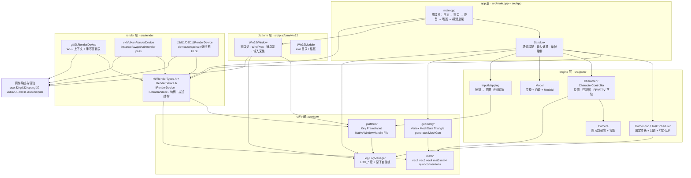

**读图的要点**：`Sandbox` 只连 `RHI`（不连任何具体后端）；三个后端也只连 `RHI`；`Win32Window`
把 `NativeWindowHandle{ HWND, HINSTANCE }` 交给后端。**唯一写死后端名字的地方是 `main.cpp`。**

---

## 2. 层与构建目标

### 2.1 目标清单（CMakeLists.txt）

| 目标 | 类型 | 源文件 | 链接 |
|---|---|---|---|
| `stv3d_core` | STATIC | `src/core/**`（core_smoke、log、platform、math、geometry） | 只链 C++ 标准库 |
| `stv3d_engine` | STATIC | `src/game/{Camera.h, Model.h, Character.*, GameLoop.*, InputMapping.*}` | `PUBLIC stv3d_core` |
| `stv3d_platform_win32` | STATIC | `src/platform/win32/{Win32Window.*, Win32Module.*}` | `PUBLIC stv3d_core` `PRIVATE user32 gdi32` |
| `stv3d_render` | **INTERFACE** | `src/render/rhi/{RenderDevice.h, RenderTypes.h}`（只有头） | `INTERFACE stv3d_core` |
| `stv3d_render_gl` | STATIC | `src/render/gl/*` | `PUBLIC stv3d_render` `PRIVATE opengl32 gdi32` |
| `stv3d_render_vk` | STATIC | `src/render/vk/*` | `PUBLIC stv3d_render` `PRIVATE ${VULKAN_LIBRARY}` |
| `stv3d_render_d3d11` | STATIC | `src/render/d3d11/*` | `PUBLIC stv3d_render` `PRIVATE d3d11 dxgi d3dcompiler` |
| `stv3d-lab` | 可执行 | `src/main.cpp`、`src/app/Sandbox.*` | 以上全部 + `cpr::cpr` + `nlohmann_json::nlohmann_json` |
| `stv3d_core_tests` / `stv3d_engine_tests` / `stv3d_core_log_tests` / `stv3d_core_geometry_tests` | 可执行 | `tests/*.cpp` | 分别只链 `stv3d_core` / `stv3d_engine` |
| `stv3d-spirv` | 自定义（非 ALL） | 用 `glslangValidator` 生成 `build/shaders/basic.*.spv` | — |
| `stv3d-assets` | 自定义（**ALL**，每次构建都跑） | 把 `shaders/`（GLSL/HLSL + SPIR-V）同步到 exe 旁边 | 依赖 `stv3d-spirv` |

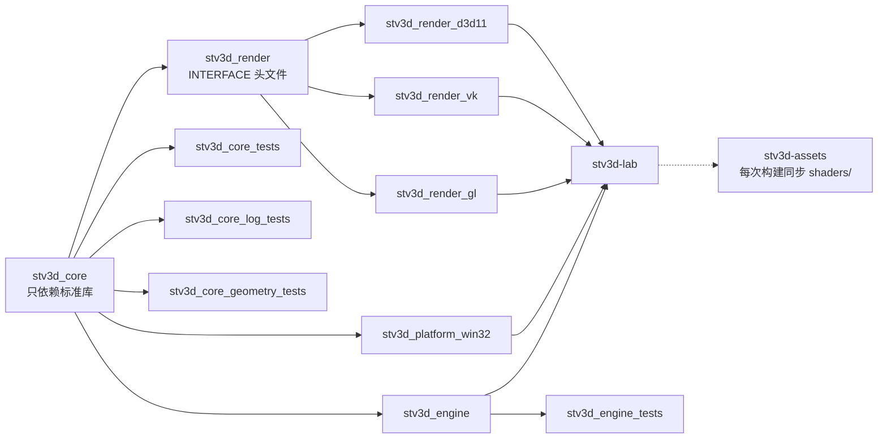

### 2.2 分层判据（新文件放哪）

| 放哪 | 判据 |
|---|---|
| `src/core/` | 纯算法/数据：数学、几何生成、日志、平台无关**值类型**（Key / FrameInput / 句柄）。依赖限于 C++ 标准库 |
| `src/game/` | 场景与规则：模型实例、摄像机、角色、主循环、输入**映射**（可脱离窗口单测） |
| `src/platform/<os>/` | 窗口、消息泵、输入采集、文件路径——**唯一**允许 `#include <windows.h>` 的地方 |
| `src/render/<api>/` | 只跟 GPU 打交道：上下文、函数表、缓冲、着色器、管线 |
| `src/render/rhi/` | 只放接口与值类型，**不含**任何 API 头文件 |
| `src/app/` + `src/main.cpp` | 组装：只有这里知道"当前用哪个后端" |

### 2.3 分层是被编译期强制的

`stv3d_core` / `stv3d_engine` 只带 `src/` 一个 include 目录，也不做任何 `find_package`，所以：

- core/engine 里写 `#include <windows.h>` 或 `<GL/gl.h>` → **直接编译失败**
- 全项目 15 个 TU 都能用裸 `g++ -std=c++17 -c <file> -Isrc` 单独编过（用不着 CMake 与 vcpkg；
  Vulkan 那个需要 `-I<vcpkg>/installed/x64-mingw-dynamic/include`）
- `src/core/core_smoke.cpp` 是守卫 TU，唯一作用就是"core 一旦被污染就编译不过"
- `Win32Window.h` 只暴露普通整数（消息处理器 + 宽度 `static_assert`），`<windows.h>` 留在平台层的 .cpp 里，
  这样 `near`/`far`/`min`/`max` 这些宏进不了 engine 与 app

---

## 3. 目录与文件地图

| 路径 | 目标 | 职责 | 关键类型 / 方法 |
|---|---|---|---|
| `src/main.cpp` | exe | 组装根：解析 `--api`、建窗口/设备/场景、裸主循环、按序收尾 | `parseRequestedApi(argc, argv)` |
| `src/app/Sandbox.{h,cpp}` | exe | 场景装配 + 输入处理 + 单帧绘制（只认 RHI） | `Sandbox`、`GpuMesh` |
| `src/platform/win32/Win32Window.{h,cpp}` | platform | 窗口类注册、消息泵、输入采集 → `FrameInput` | `create/pumpMessages/input/endFrame/nativeHandle` |
| `src/platform/win32/Win32Module.{h,cpp}` | platform | exe 目录与完整路径 | `executableDirectory()/executablePath()` |
| `src/render/rhi/RenderTypes.h` | INTERFACE | 句柄、枚举、描述结构 | `BufferHandle` `ShaderDesc` `PipelineDesc` `SwapchainDesc` |
| `src/render/rhi/RenderDevice.h` | INTERFACE | RHI 接口 | `ICommandList`、`IRenderDevice` |
| `src/render/gl/GLContext.{h,cpp}` | gl | WGL 上下文：像素格式 → 4.3 core → vsync | `GLContext::create(nativeHandle, Config)` |
| `src/render/gl/GLFunctions.{h,cpp,inc}` | gl | 手写 X-macro 函数表（44 个入口点） | `GLFunctions::load()/missingFunction()` |
| `src/render/gl/GLRenderDevice.{h,cpp}` | gl | `IRenderDevice` 的 OpenGL 实现 | `GLRenderDevice::CommandList` |
| `src/render/vk/VulkanRenderDevice.{h,cpp}` | vk | `IRenderDevice` 的 Vulkan 实现 | instance/device/swapchain/render pass/同步 |
| `src/render/d3d11/D3D11RenderDevice.{h,cpp}` | d3d11 | `IRenderDevice` 的 D3D11 实现 | device/swapchain/input layout/HLSL |
| `src/game/Camera.h` | engine | 位置 + 单位四元数 + 投影参数 | 见 §9.1 |
| `src/game/Model.h` | engine | 变换 + 自转 + `MeshId` 引用几何 | 见 §9.2 |
| `src/game/Character.{h,cpp}` | engine | 角色与控制器、FPV/TPV 摆位、轨道 | 见 §9.3 |
| `src/game/GameLoop.{h,cpp}` | engine | 固定步长逻辑刻 + 每帧 + 待办队列 | 见 §9.4 |
| `src/game/InputMapping.{h,cpp}` | engine | 按键 → 意图（纯函数，有单测） | `characterInputFromKeys/viewToggleRequested/resetRequested/quitRequested` |
| `src/core/math/*.h` | core | 数学：列主序 mat3/mat4、quat、vec2/3/4、约定唯一出处 | `conventions.h` |
| `src/core/geometry/*` | core | CPU 几何：`Vertex`（唯一顶点格式）、`MeshData`、`MeshGen::makeCube` | 见 §8.1 |
| `src/core/platform/*` | core | 平台无关值类型 + 文件读取 | `Key`、`FrameInput`、`NativeWindowHandle`、`File` |
| `src/core/log/*` | core | 日志（std-only） | `LogManager`、`LogStream`、`LOG_*` |
| `src/*/{physics,loader,ecs,render/resources}` | — | 占位头文件，尚未实现 | — |
| `tests/*.cpp` | 各测试目标 | 227 项检查（见 §12） | — |
| `shaders/basic.vert/.frag/.hlsl` | 资源 | 一份逻辑，三种方言 | — |

---

## 4. 启动与主循环

### 4.1 启动时序

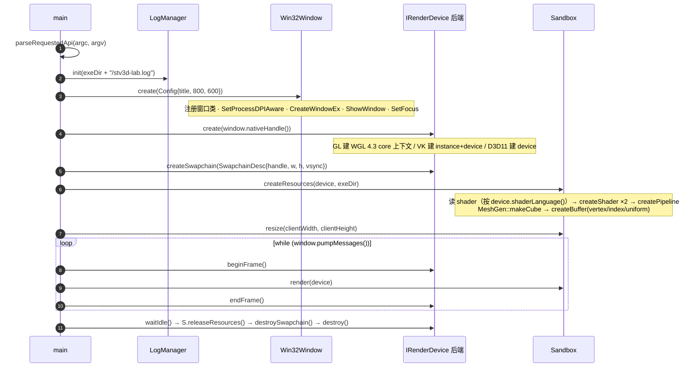

### 4.2 循环体（`main.cpp` 的真实形状）

```cpp
while (window.pumpMessages()) {                       // 非阻塞收完整队消息；false = 窗口已关
    const FrameInput &input = window.input();
    if (InputMapping::quitRequested(input)) break;     // Esc 或关闭按钮

    sandbox.handleInput(input);                        // 切人称 / 复位 / 滚轮 / 拖拽
    if (input.resized) {                               // 客户区变了
        device->resizeSwapchain(w, h);
        sandbox.resize(w, h);
    }

    sandbox.getGameLoop().advance();                   // 时间在这里被消费（0..N 个逻辑刻）

    device->beginFrame();                              // 取 back buffer
    sandbox.render(*device);                           // clear + bind + draw
    device->endFrame();                                // 提交 + present（vsync 限帧）

    window.endFrame();                                 // 清掉每帧量（edge/鼠标增量/滚轮/resized）
}
```

### 4.3 `GameLoop` 状态机

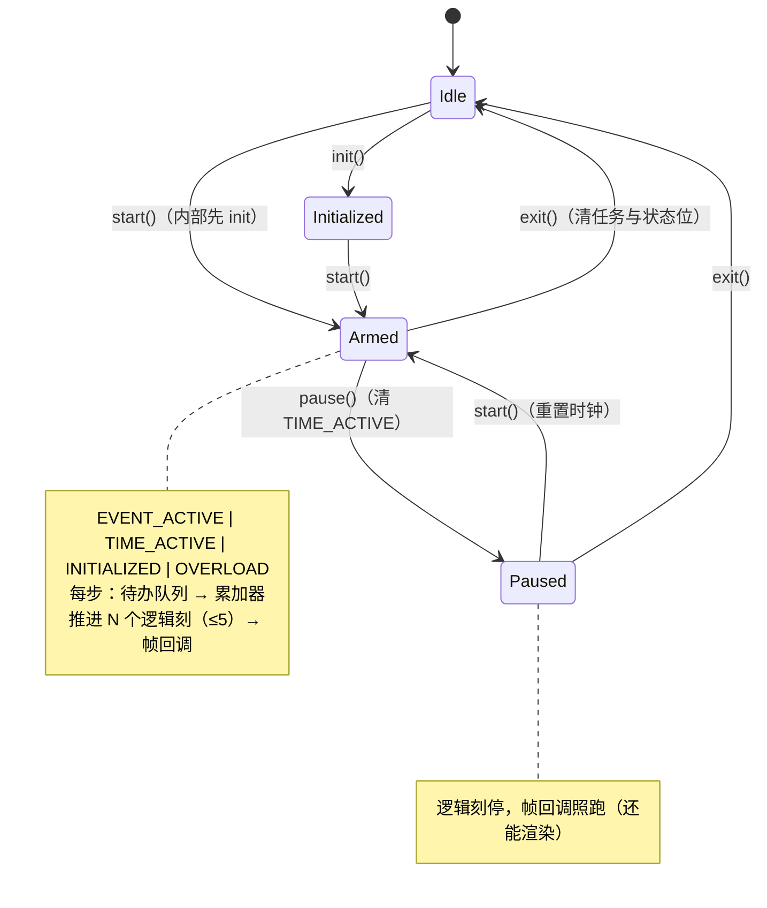

| 时间相关的量 | 默认 | 说明 |
|---|---|---|
| `fixed_tick_seconds` | `1/60` | 逻辑刻步长；`setFixedTickSeconds` 只接受 > 0 |
| `frame_interval_ms` | `16` | 给平台泵的**建议**间隔，循环自己从不等待 |
| 每步最多补刻数 | `5` | 超过就丢弃积压（防死亡螺旋） |
| `tick_accumulator` | — | 不足一刻的余量，`getTickAccumulator()` 给测试用 |

---

## 5. 一帧的完整链路

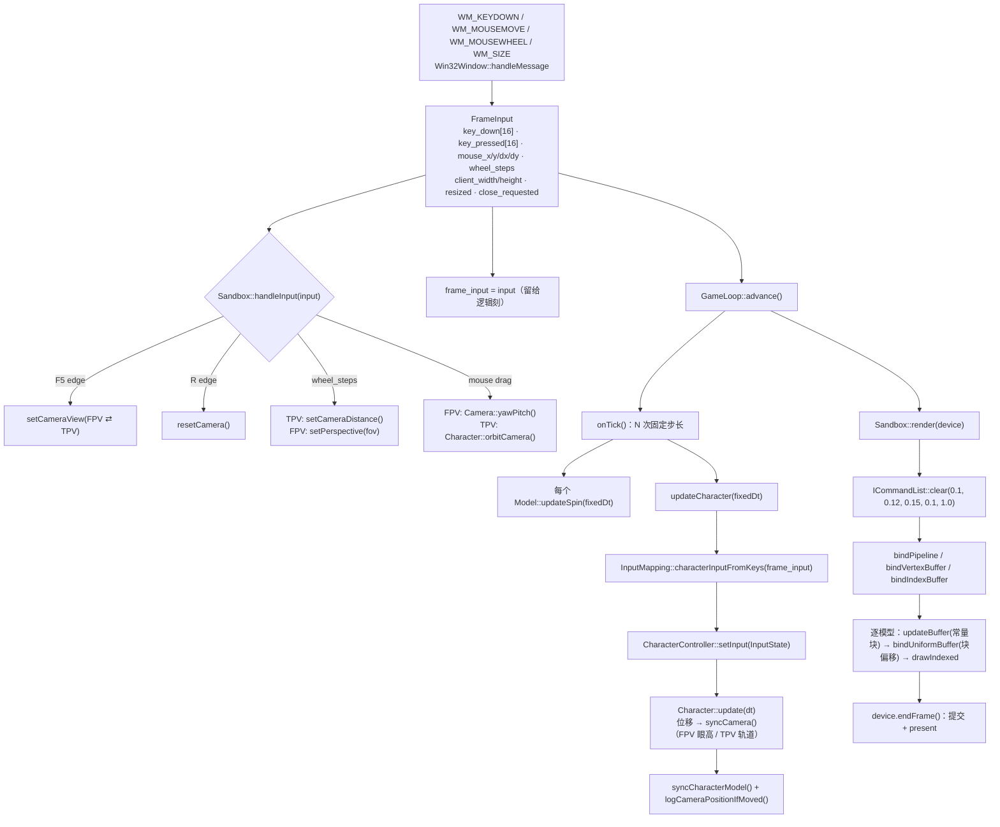

---

## 6. RHI 接口（方法级）

### 6.1 接口与实现

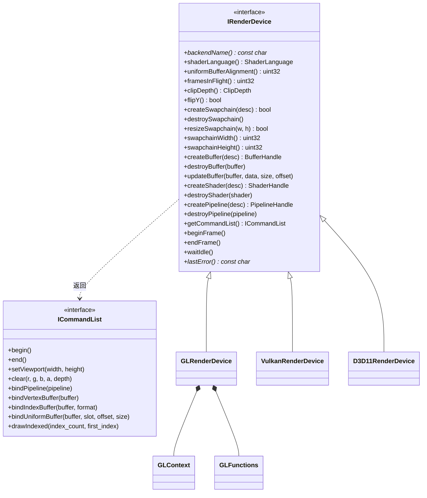

### 6.2 每个方法的语义与责任方

| 方法 | 语义 | 谁负责什么 |
|---|---|---|
| `backendName()` | 写日志用的一行自述 | 后端拼 `"Vulkan 1.2 \| GTX 1050 Ti"` 之类 |
| `shaderLanguage()` | 本后端要哪种着色器字节 | 应用据此决定读 `.vert/.frag` 还是 `.spv` 还是 `.hlsl` |
| `uniformBufferAlignment()` | 常量块偏移对齐要求 | GL 查 `GL_UNIFORM_BUFFER_OFFSET_ALIGNMENT`；VK 取 `minUniformBufferOffsetAlignment`（通常 64 或 256）；D3D11 固定给 256，以便与 VK 共用一套块布局 |
| `framesInFlight()` | 允许几帧同时在飞 | 应用据此分配"每 draw × 每帧"常量槽（GL 1、VK/D3D11 2） |
| `clipDepth()` / `flipY()` | 本后端的剪裁空间约定 | 应用交给 `Camera::setClipDepth/setFlipY`，投影矩阵按后端算对 |
| `createSwapchain(desc)` | 用 `NativeWindowHandle` + 尺寸 + vsync 建交换链 | 后端各有自己的 surface/DC/back buffer 处理 |
| `resizeSwapchain(w,h)` | 客户区变化 | GL 只改视口；VK 重建整条 swapchain；D3D11 `ResizeBuffers` |
| `createBuffer(desc)` | 上传或预留一块 GPU 缓冲，返回句柄 | 顶点/索引通常一次性 `initial_data`；常量缓冲留空后写 |
| `updateBuffer(b, data, size, offset)` | 改写缓冲的一部分 | 应用保证不覆写"帧在飞还可能读"的区域 |
| `createShader(desc)` | 编译/加载一个阶段 | GL 编译 GLSL；VK 建 `VkShaderModule`；D3D11 运行期 `D3DCompile` |
| `createPipeline(desc)` | 顶点布局 + 固定状态 + 着色器 → 一个可绑定对象 | 顶点属性的语义/格式映射在后端（D3D 需要 `POSITION`/`COLOR` 语义名） |
| `beginFrame()` | 取下一张 back buffer、让设备 current | VK 等 fence + acquire；D3D11 设 RTV/DSV + viewport；GL `makeCurrent` + viewport |
| `endFrame()` | 提交并呈现 | GL `SwapBuffers`；VK submit + present（含 OUT_OF_DATE 处理）；D3D11 `Present(vsync)` |
| `waitIdle()` | 等 GPU 做完 | GL `glFinish`；VK `vkDeviceWaitIdle`；D3D11 `Flush` |
| `ICommandList::begin()/end()` | 一帧命令的边界 | GL/D3D11 只切标志（立即上下文）；VK 真正 `vkBegin/EndCommandBuffer` |
| `clear(...)` | 清颜色与深度 | VK 里它**开始 render pass**（因此必须是本帧第一条命令）；GL/D3D11 是直接清 |
| `bindUniformBuffer(b, slot, offset, size)` | 让接下来的 draw 看到这段常量 | 见 §8.3（三个后端三种落地方式） |

### 6.3 值类型（字段级）

| 类型 | 字段 | 说明 |
|---|---|---|
| `BufferHandle` / `ShaderHandle` / `PipelineHandle` | `uint32_t` | 后端槽位下标，`kInvalidHandle == 0` |
| `ShaderLanguage` | `GLSLSource` / `SPIRV` / `HLSLSource` | 决定应用读哪个着色器文件 |
| `BufferUsage` | `Vertex` / `Index` / `Uniform` | 决定绑定方式与内存策略 |
| `IndexFormat` | `UInt16` / `UInt32` | 本项目用 `UInt32` |
| `VertexFormat` | `Float32` … `Float32x4` | 配合 `vertexFormatSize()` 算偏移 |
| `VertexAttribute` | `location` / `format` / `offset` | `location` 对齐 shader 的 `layout(location=N)` |
| `BufferDesc` | `size` / `usage` / `initial_data` | `initial_data` 可为空（之后 `updateBuffer` 填） |
| `ShaderDesc` | `stage` / `code` / `size` / `debug_name` | `code` 的**含义**由 `shaderLanguage()` 决定 |
| `PipelineDesc` | `vertex_shader` / `fragment_shader` / `attributes` / `attribute_count` / `vertex_stride` / `topology` / `depth_test` / `depth_write` | 目前只有深度状态；剔除/混合等按需再加 |
| `SwapchainDesc` | `window`(NativeWindowHandle) / `width` / `height` / `vsync` | `NativeWindowHandle{ void* window; void* instance; }` |

---

## 7. 三个后端

### 7.1 方法映射总表

| RHI | OpenGL 4.3（WGL） | Vulkan 1.0+ | Direct3D 11 |
|---|---|---|---|
| `beginFrame` | `makeCurrent` + `glViewport` + list begin | 等 fence → `vkAcquireNextImageKHR` → `vkResetCommandBuffer` → `vkBeginCommandBuffer` | `OMSetRenderTargets` + `RSSetViewports` + list begin |
| `clear` | `glClearColor` + `glDepthMask(true)` + `glClear` | `vkCmdBeginRenderPass`（带 clear 值） | `ClearRenderTargetView` + `ClearDepthStencilView` |
| `bindPipeline` | `glUseProgram` + 深度状态 + 顶点布局写进 VAO | `vkCmdBindPipeline` | `IASetInputLayout` + `IASetPrimitiveTopology` + `VSSetShader`/`PSSetShader` + `OMSetDepthStencilState` + `RSSetState` |
| `bindVertexBuffer` | `glBindVertexBuffer(0, id, 0, stride)` | `vkCmdBindVertexBuffers` | `IASetVertexBuffers` |
| `bindIndexBuffer` | `glBindBuffer(GL_ELEMENT_ARRAY_BUFFER, id)` | `vkCmdBindIndexBuffer` | `IASetIndexBuffer` |
| `bindUniformBuffer` | `glBindBufferRange(GL_UNIFORM_BUFFER, …)` | 动态偏移描述符 + `vkCmdBindDescriptorSets` | 每个块一个常量缓冲 + `VSSetConstantBuffers` |
| `drawIndexed` | `glDrawElements` | `vkCmdDrawIndexed` | `DrawIndexed` |
| `endFrame` | `SwapBuffers` | `vkQueueSubmit` + `vkQueuePresentKHR` | `Present(vsync ? 1 : 0, 0)` |
| `waitIdle` | `glFinish` | `vkDeviceWaitIdle` | `Flush` |
| 着色器 | GLSL 文本 | SPIR-V 二进制 | HLSL 文本（入口 `VSMain`/`PSMain`） |
| 剪裁空间 | `[-1,1]`，+Y 上 | `[0,1]`，+Y 下 | `[0,1]`，+Y 上 |
| 常量对齐 | 16 | 256 | 256（D3D 只要求 16，取 256 与 VK 同布局） |
| 帧在飞 | 1 | 2 | 2 |

### 7.2 OpenGL 后端内部链路

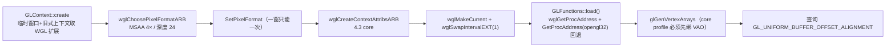

**函数表**（`GLFunctions.inc`，44 个入口点，X-macro 一处声明一处解析）：
着色器/程序 15、uniform 4、缓冲与 VAO 10、显式顶点属性 4、绘制与状态 11。

### 7.3 Vulkan 后端内部链路

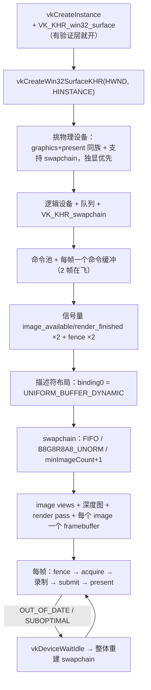

### 7.4 D3D11 后端内部链路

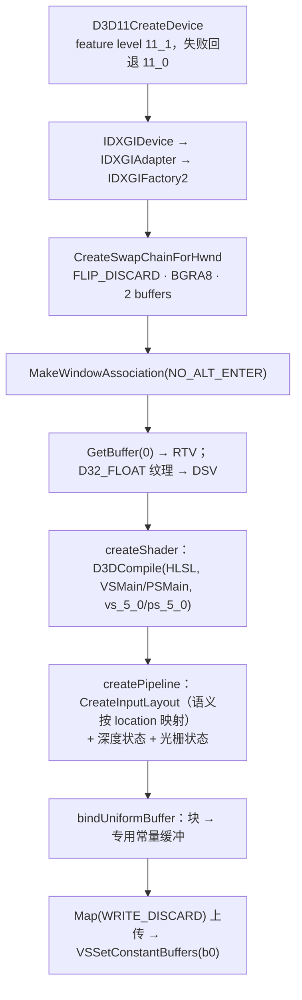

**为什么常量要"每块一个小缓冲"**：D3D11 的 `WRITE_NO_OVERWRITE` 只对 vertex/index buffer 有效，
常量缓冲必须 `WRITE_DISCARD`；而 `ID3D11DeviceContext1::*SetConstantBuffers1` 的范围绑定跨驱动不可靠。
因此后端内部为每个 `(uniform buffer, 偏移)` 惰性建一个 64 字节常量缓冲，用最经典的
`VSSetConstantBuffers` 整块绑定——应用侧调用方式不变，也不依赖 D3D11.1。

---

## 8. 资源链路

### 8.1 CPU → GPU：几何与常量

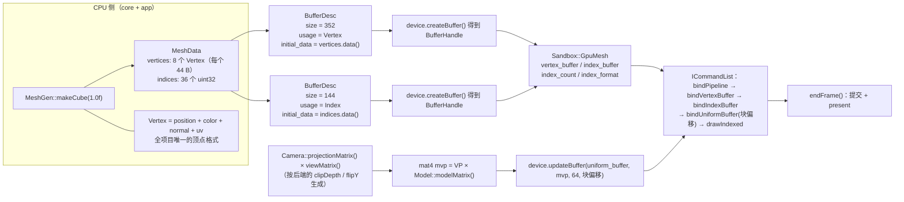

### 8.2 所有权与销毁顺序

| 资源 | 创建者 | 持有者 | 销毁时机 |
|---|---|---|---|
| `GLContext` / `VkInstance+VkDevice` / `ID3D11Device` | 后端 `create()` | 后端对象 | `destroy()`（`main` 最后调用） |
| swapchain 相关（DC/views/render pass/framebuffers/RTV+DSV） | 后端 `createSwapchain()` | 后端对象 | `destroySwapchain()`（在 `releaseResources()` **之后**） |
| 顶点/索引缓冲、常量缓冲、shader、pipeline | `Sandbox::createResources()` 经 `device.createXxx()` | **设备**（句柄存在 `Sandbox`） | `Sandbox::releaseResources()`（设备仍活着、GL 上下文仍 current） |
| `MeshData`（CPU 几何） | `MeshGen` | `Sandbox::createResources` 的局部变量 | 函数返回即释放（数据已上传） |
| `Model` / `Character` / `Camera` / `GameLoop` | `Sandbox` 成员 | `Sandbox` | `Sandbox` 析构 |

**收尾顺序（`main.cpp`）**：`device->waitIdle()` → `sandbox.releaseResources()` →
`device->destroySwapchain()` → `gl_device.destroy()` / `vk_device.destroy()` / `d3d11_device.destroy()` →
`window.destroy()` → 写退出日志 → `LogManager::shutdown()`。

### 8.3 每 draw 常量分槽（为什么不是一个块）

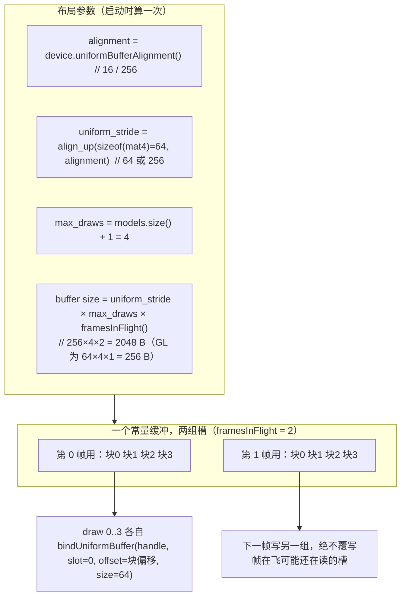

| 后端 | `framesInFlight()` | `bindUniformBuffer` 的实际动作 |
|---|---|---|
| GL | 1 | `glBindBufferRange(GL_UNIFORM_BUFFER, 0, id, offset, 64)` |
| Vulkan | 2 | 本帧的 `UNIFORM_BUFFER_DYNAMIC` 描述符（仅在 buffer/range 变化时重写）+ `vkCmdBindDescriptorSets` 传动态偏移 |
| D3D11 | 2 | 取/建该偏移的专用常量缓冲，`Map(WRITE_DISCARD)` 上传 64 字节，`VSSetConstantBuffers(b0)` |

---

## 9. 引擎数据模型

### 9.1–9.4 类图

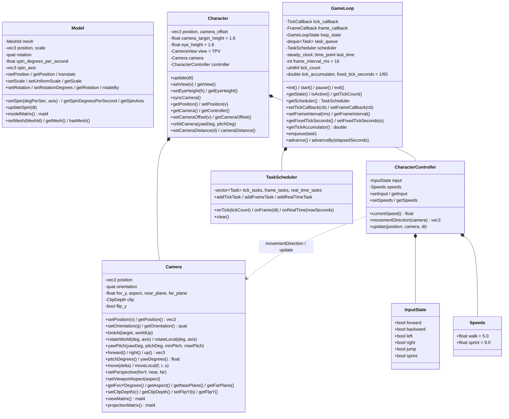

### 9.5 关键常量（现行值）

| 量 | 值 | 位置 |
|---|---|---|
| 逻辑刻 | `1/60 s` | `GameLoop::fixed_tick_seconds` |
| 帧间隔建议 | `16 ms` | `GameLoop::frame_interval_ms` |
| 补刻上限 | `5` | `GameLoop.cpp` `kMaxSubSteps` |
| 行走 / 疾跑 | `5 / 9 m/s` | `CharacterController::Speeds` |
| FPV 眼高 | `1.6 m` | `Character::eye_height` |
| TPV 注视高度 | `1.6 m` | `Character::camera_target_height` |
| TPV 偏移 | `(0, 2, 5)` | `Character::camera_offset` |
| TPV 轨道俯仰限位 | `[-89°, +89°]` | `Character::orbitCamera` |
| TPV 距离钳制 | `[0.5, 100] m` | `Character::setCameraDistance` |
| FPV 俯仰限位 | `[-85°, +85°]` | `Camera::yawPitch` 默认参数 |
| 透视 | `fov 90°`、`near 0.1`、`far 100` | `Sandbox::resetCamera` |
| 拖拽灵敏度 | `0.4 °/px` | `Sandbox::orbit_speed` |
| 滚轮步长 | `0.5 m/档`（TPV）/ `2° /档`（FPV） | `Sandbox::wheel_step` |
| 机位日志阈值 | 位置 `0.5 m` 或 `dot(forward) < 0.999` | `Sandbox::log_move_threshold` |
| 清屏色 | `(0.1, 0.12, 0.15, 0.1)`，深度 `1.0` | `Sandbox::render` |
| 窗口 | `800 × 600` | `main.cpp` 的 `Win32Window::Config` |

---

## 10. 平台层：输入与日志

### 10.1 Win32 消息 → `FrameInput`

| 消息 | 处理 |
|---|---|
| `WM_KEYDOWN` / `WM_SYSKEYDOWN` | `keyFromVirtualKey()` → `Key`；首次按下才置 `key_pressed`（Windows 会重复发 KEYDOWN） |
| `WM_KEYUP` / `WM_SYSKEYUP` | 清 `key_down` |
| `WM_KILLFOCUS` | 清空所有键与左键（丢焦点会丢配对的 KEYUP，否则"角色一直走"） |
| `WM_MOUSEMOVE` | 累加 `mouse_delta_x/y`，更新 `mouse_x/y` |
| `WM_LBUTTONDOWN/UP` | `mouse_left_down` + `SetCapture`/`ReleaseCapture` |
| `WM_MOUSEWHEEL` | `wheel_steps += delta / 120` |
| `WM_SIZE` | 更新 `client_width/height` + 置 `resized` |
| `WM_ERASEBKGND` | 返回 1（背景由渲染后端画） |
| `WM_CLOSE` | `close_requested = true`，`pumpMessages()` 随后返回 false |
| `WM_DESTROY` | `PostQuitMessage(0)` |

`pumpMessages()` 非阻塞收完整队消息；`endFrame()` 清掉每帧量（edge / 鼠标增量 / 滚轮 / resized），
保留"状态"（按住哪些键、光标位置）。

### 10.2 按键 → 意图（`InputMapping`，纯函数、有单测）

| 按键（`Key`） | 意图 |
|---|---|
| `W` / `Up` | `InputState::forward` |
| `S` / `Down` | `backward` |
| `A` / `Left` | `left` |
| `D` / `Right` | `right` |
| `Space` / `E` | `jump`（无物理，仅意图） |
| `Shift` | `sprint` |
| `F5`（edge） | 切 FPV ⇄ TPV |
| `R`（edge） | 复位角色与机位 |
| `Esc`（edge）或关闭按钮 | 退出 |
| `C` / `Q` | 平台层认识，但 `InputState` 没有对应字段（角色无垂直移动） |

### 10.3 日志链路

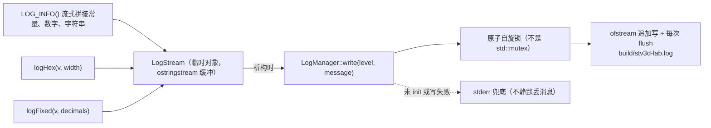

- 格式：`2026-10-05 22:43:36.797 [INFO] shader program ready: id = 3 | vertex: ...`
- 级别标签：`DEBUG` / `INFO` / `WARN` / `ERROR` / `FATAL`（`FATAL` 写完 `abort()`）
- 一条消息 = 一行（`\n` 被折成 ` | `）；`init(path)` 的路径由 app 计算（core 不碰平台 API）
- **锁为什么是自旋锁**：日志的临界区极短，而且不引用 pthread 符号，就不会与第三方 DLL 导入库里导出的同名符号冲突

---

## 11. 着色器与资源部署

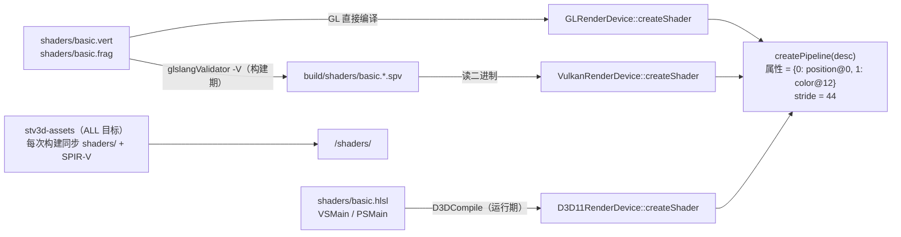

- 着色器里的常量块三方言等价：GLSL `layout(std140, binding = 0) uniform Scene { mat4 uMvp; }`、
  HLSL `cbuffer Scene : register(b0)`、SPIR-V 由前者生成
- SPIR-V 要求用户输入/输出都带显式 `location`（OpenGL 不要求），所以 `vColor` 也写了 location
- **为什么用 always-run 目标而不是 `POST_BUILD`**：`POST_BUILD` 只在目标重新链接时执行，
  改 shader 不重新链接就不会部署

---

## 12. 测试与验证

### 12.1 单测（`ctest` 4 套，共 227 项）

| 套件 | 链接 | 覆盖 | 检查项 |
|---|---|---|---|
| `tests/core_math_test.cpp` | 仅 `stv3d_core` | 列主序布局、`fromTRS` 的 S→R→T、`lookAt` 退化、透视两套裁剪空间、`ortho`、四元数、mat3/mat4 逆与行列式 | 67 |
| `tests/core_log_test.cpp` | 仅 `stv3d_core` | 行格式与时间戳、级别标签、流式拼接、`logFixed/logHex`、**4 线程 × 50 行不丢不串**、init/shutdown 幂等与追加 | 26 |
| `tests/core_geometry_test.cpp` | 仅 `stv3d_core` | 顶点 44 字节、`MeshData` 语义、立方体顶点/索引数、索引在范围内、无退化三角形、**12 面绕序一致朝外**、尺寸只改位置、法线单位且朝外 | 17 |
| `tests/engine_test.cpp` | 仅 `stv3d_engine` | Camera（含 500 次随机旋转后无滚转且正交）、Model、Character/Controller、**GameLoop**（累加器余数、10 秒卡顿只补 5 刻、pause/start、enqueue、非法参数）、**InputMapping**（edge 不粘滞、clearPerFrame 语义） | 117 |

### 12.2 后端画面回归（单测覆盖不到的部分）

方法：启动 → 窗口置顶（DPI-aware + `ClientToScreen`）→ 抓客户区 → 按列统计 clear 色之外的像素分组。

| 后端 | 客户区 | clear 色 | 左立方体 | 中 | 右立方体 | 两帧变化 | 日志错误 | 退出码 |
|---|---|---|---|---|---|---|---|---|
| `--api gl`（Intel UHD 630, 4×MSAA, GLSL） | 800×600 | (25,31,38) | 0.242–0.330 | 0.478–0.522 | 0.655–0.778 | 2481 | 0 | 0 |
| `--api vk`（GTX 1050 Ti, 1 sample, SPIR-V） | 800×600 | (25,31,38) | 0.255–0.325 | 0.478–0.522 | 0.658–0.772 | 2435 | 0 | 0 |
| `--api d3d11`（Intel UHD 630, 1 sample, HLSL） | 800×600 | (25,31,38) | 0.245–0.330 | 0.478–0.522 | 0.652–0.785 | 2611 | 0 | 0 |

"两帧变化"同时证明固定步长逻辑刻在跑（模型自转只可能来自 tick）。

### 12.3 解耦证明（裸编译器）

15 个 TU 用 `g++ -std=c++17 -c <file> -Isrc` 单独编过：
`core_smoke` `LogManager` `File` `MeshGen` `Character` `GameLoop` `InputMapping`
`GLFunctions` `GLContext` `GLRenderDevice` `VulkanRenderDevice` `D3D11RenderDevice`
`Sandbox` `Win32Window` `Win32Module`（Vulkan 那个需要 `-I<vcpkg>/.../include`）。

---

## 13. 扩展点

### 13.1 加第 4 个后端（例如 D3D12 / Metal）

1. 新建 `src/render/<api>/XxxRenderDevice.{h,cpp}`，实现 `IRenderDevice` 全部纯虚函数
2. `CMakeLists.txt` 加一个 `stv3d_render_<api>` STATIC 目标，`PUBLIC stv3d_render` + 该 API 的库
3. `main.cpp`：加一个实例、在 `--api` 分支里建它（**唯一**需要改的应用代码）
4. 若着色器方言是新的：加一个 `shaders/basic.<ext>` 并在 `Sandbox::createResources` 的
   `switch (device.shaderLanguage())` 里加分支
5. 跑 §12.2 的画面回归，位置与三个旧后端对齐即通过
6. RHI 缺什么就补接口（例如纹理、采样器、barrier），**不要在应用里特判后端**

### 13.2 其他常见需求落在哪

| 需求 | 落点 |
|---|---|
| 纹理 / 采样器 | `IRenderDevice::createTexture/createSampler` + `ICommandList::bindTexture(slot, …)`；三后端各自映射（GL texture unit / VK descriptor / D3D11 SRV） |
| MSAA、剔除、混合 | `PipelineDesc` 扩字段（现在只有 `depth_test`/`depth_write`） |
| 多 pass / 离屏 | `IRenderDevice` 加 render target 概念（GL FBO / VK framebuffer / D3D11 RTV 组合） |
| 多线程录制 | `getCommandList()` 改为 `createCommandList()` 池化（Vulkan/D3D12 才真正受益） |
| 场景/渲染队列 | 现在 `Sandbox::render` 线性遍历模型；按 pipeline/材质分组即可升级为队列 |
| 资源自动 barrier | 引入 RenderGraph（RHI 之上的一层），不在 RHI 内做 |

---

## 14. 已知简化与边界

| 项 | 现状 |
|---|---|
| RHI 范围 | 只管"画三角形要的东西"：缓冲、着色器、管线、常量、交换链。没有纹理、没有 compute、没有多渲染目标 |
| Vulkan | 单队列族、无 MSAA、所有 buffer 走 host-visible coherent 常驻映射、present mode 固定 FIFO、resize 整体重建 swapchain、render pass 按第一次的格式建一次 |
| D3D11 | 无 MSAA；每个常量块一个专用缓冲（见 §7.4）；RTV/DSV 在交换链创建时建一次；若将来出现黑屏或撕裂，第一处该查的就是 flip 模型下 back buffer 的重取时机 |
| OpenGL | 4×MSAA；core profile（禁一切 legacy） |
| 引擎 | 角色只有水平移动（无重力/跳跃/碰撞）；`GameLoop::pause/exit` 已测但应用未接（可绑暂停键） |
| 物理 / loader / ECS / render.resources | 只有占位头文件 |
| 已知待修 | `main.cpp` 的 httpbin 自检会阻塞启动约 1 秒，可按需删除 |
| 跨平台 | 平台层目前只有 `win32/`；`NativeWindowHandle` 与 `IRenderDevice` 已经是平台中立的，加 `platform/x11` 是实现问题 |

---

## 附：文档维护约定

- 改了 **RHI 接口** → 更新 §6、§7.1、§8.3
- 改了 **引擎类型/常量** → 更新 §9
- 加了 **后端或着色器方言** → 更新 §7、§11、§12.2
- 改了 **构建目标** → 更新 §2.1、§2.2
- 这份图里的数值都来自真实代码；发现不一致时以代码为准，并回来修这里
